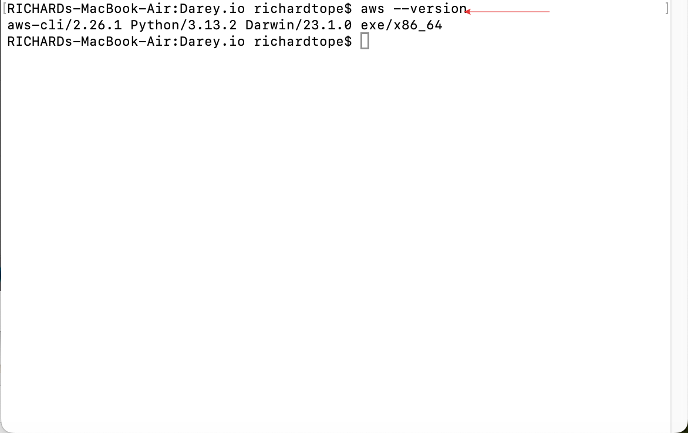

# DataWise-Solution-shell
Shell script for automating the setup of EC2 instances and S3 buckets.

The objective of this project is to automate the setup of EC2 instances and S3 buckets using AWS.

## Step 1: Preparing our Environment

In the previous project, we installed and configured AWS CLI on our system.  
To test, we will run the command `aws --version`.

From the picture above, we can see AWS CLI is already installed and configured. We have set up the credentials and default region.

## Step 2: Beginning the Script

We are going to begin by creating a file and naming it **DataWise-script**.

- We will start the script with a shebang (`#!/bin/bash`) at the top to indicate the script uses bash.
- We will then set up the environment variables as seen below.

## Step 4: Create Functions

- We will add a function to check script arguments. We will encapsulate logic to validate the script arguments.

- We will add another function to check AWS CLI installation.

- We will add another function to verify the AWS profile to ensure the `AWS_PROFILE` environment variable is set.

- Then a function to activate the infrastructure environment to act based on the argument value.

- At the bottom of the script, we will call these functions in sequence to ensure the flow.

## Step 5: Test the Script

- We will make the script executable by using the command `chmod +x DataWise-script.sh`, then run the script with the argument `./DataWise-script.sh testing`.

## Step 6: Error

When trying to run our script (`DataWise-script.sh`), we ran into an issue about the AWS profile not being set.

The message indicates that your script checks for an `AWS_PROFILE` environment variable, but it's not currently set. This variable tells the AWS CLI which profile to use for authentication. Without it, the script cannot proceed with AWS operations.

## Step 7: Fixing the Issue

- Run the `aws configure list` command in our terminal to see if profiles are set up correctly.
- The result showed that our AWS profile was not set, which is why the script was unable to locate the profile for authentication.

- Next, we set the AWS profile by exporting the `AWS_PROFILE` variable manually using the command `export AWS_PROFILE=DEFAULT`.
- Then we check to see if the profile exists by running `aws configure list profile`.
- The command `echo $AWS_PROFILE` was used to verify the export, after which `aws s3 ls` was used to check S3 buckets or EC2 instances.

## Step 8: Result

- We will execute the script again using the command `./DataWise-script.sh testing`. In the image below, we can see the script correctly identified the environment argument we passed (testing, local, and production).

- We will be updating the script to improve it by encapsulating chunks of logic into functions to make the code easier to manage and read.

## Testing

- Running the script without any argument: Unset the `AWS_PROFILE` variable using `unset AWS_PROFILE`.

- Run with an invalid environment.

- Modify the script to add EC2 instance creation and S3 bucket creation.

- The script output indicates that the EC2 instance was created successfully, but there were errors creating the S3 bucket. However, the script also indicates that the S3 bucket was created successfully, which is likely due to the `BucketAlreadyExists` error.

## Summary

In this project, I successfully developed a modular shell script for automating infrastructure setup with AWS CLI. By organizing tasks into well-defined functions, such as checking arguments, validating AWS CLI installation, and verifying AWS profiles, I created a script that's clean, reusable, and efficient. I learned how to streamline workflows using functions, handle errors gracefully, and integrate AWS commands like EC2 instance creation and S3 bucket management. This experience enhanced my skills in shell scripting, automation, and cloud infrastructure, while teaching me the importance of structured code.

